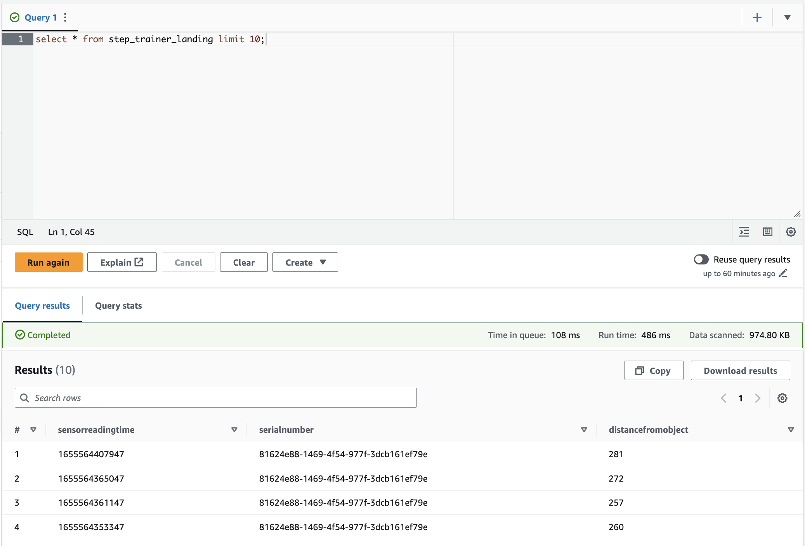
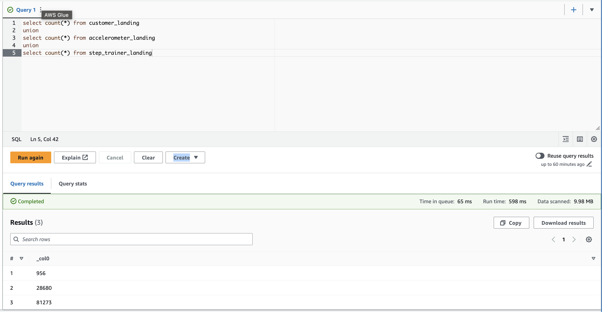
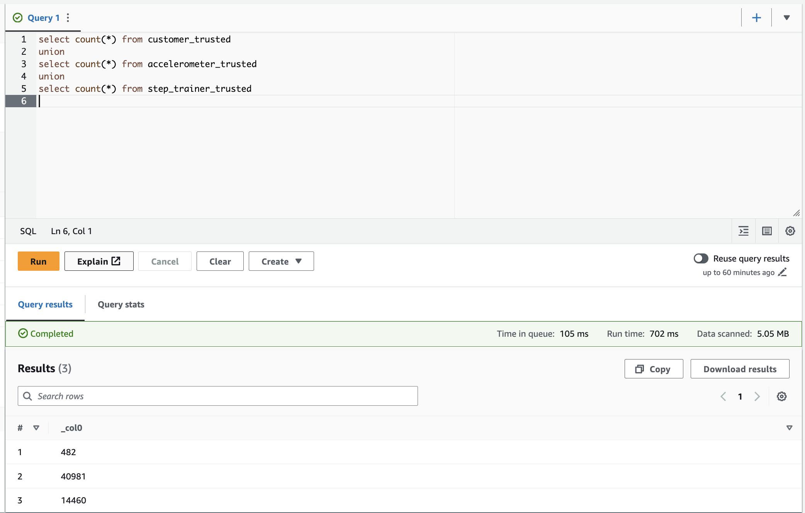
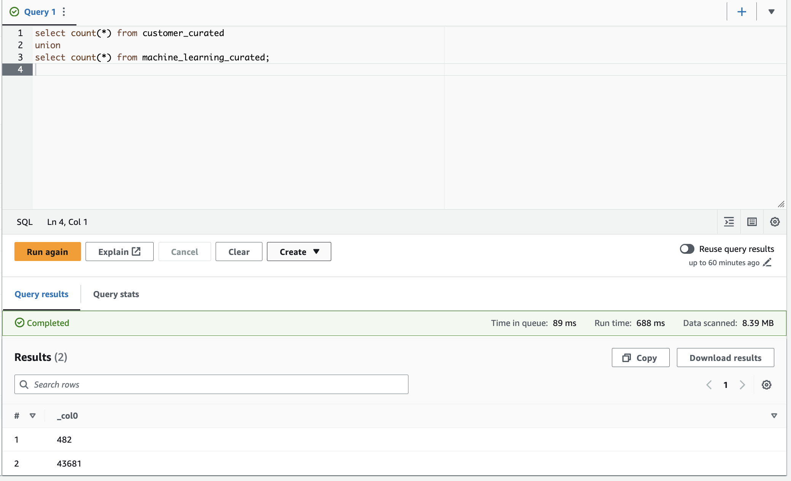
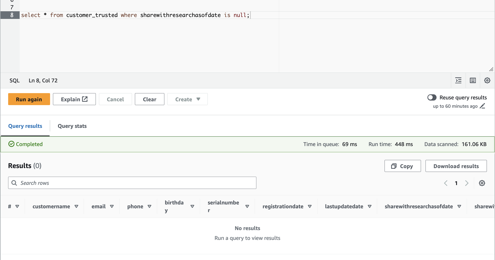

# udend-aws-data-warehouse
## Project Overview
Building a data lakehouse solution for sensor data that trains a machine learning model using Spark and AWS.

As a data engineer on the STEDI Step Trainer team, you'll need to extract the data produced by the STEDI Step Trainer sensors and the mobile app, and curate them into a data lakehouse solution on AWS so that Data Scientists can train the learning model.

## Pre-Setup on AWS
### AWS IAM
Create an user which have permission to AWS S3 and AWS Glue
### AWS S3
Create a bucket that store data (raw/ filtered, tranformed/ cleaned)
### AWS Glue
Create a job to extract data and then transform them.

## Project description
### Folder
1. You can see in folder `data` which include Landing data (Raw)
2. You can see in folder `sql` which includes SQL Script to create schema of table for storing data from AWS S3
3. You can see in folder `code` which include Python Script to transform data on AWS Glue.

### Results

After create external tables on Glue Data Catalog which can read data from S3 using Athena, there are some screenshot of Landing data about Customer, Accelerometer, and Step Trainer:
**customer_landing**

**accelerometer_landing**

**step_trainer_landing**

#### Row count check

**Landing**

**Trusted**

**curated**

#### Customer trusted check column share research all have data in this columns

